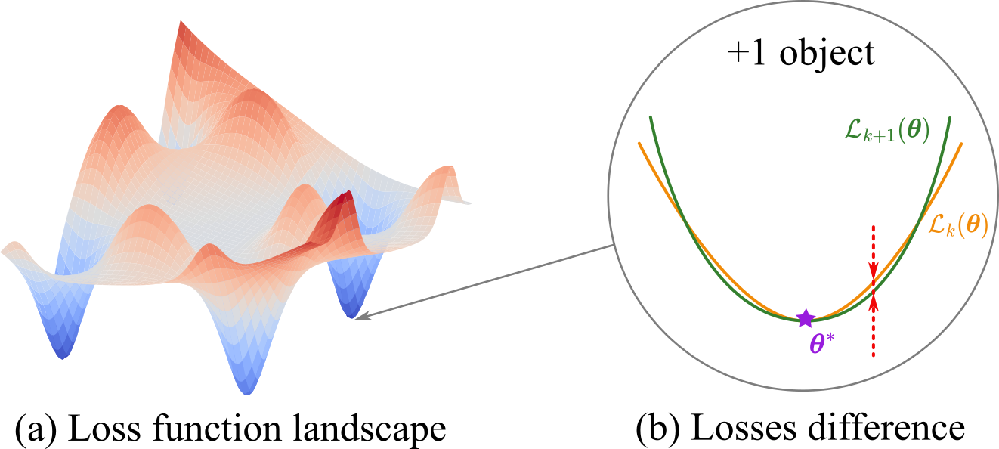

<div align="center">
<h1>Unraveling the Hessian: A Key to Smooth Convergence in Loss Function Landscapes</h1>

[Nikita Kiselev](https://github.com/kisnikser)<sup>1, 2 :email:</sup>, [Andrey Grabovoy](https://github.com/andriygav)<sup>1</sup>

<sup>1</sup> Moscow Institute of Physics and Technology, <sup>2</sup> Sber AI

<sup>:email:</sup> Corresponding author

[📝 Paper](https://github.com/kisnikser/landscape-hessian/blob/main/paper/main.pdf), [</> Code](https://github.com/kisnikser/landscape-hessian/tree/main/code), [🪧 Slides](https://github.com/kisnikser/landscape-hessian/blob/main/slides/main.pdf)

</div>

## 💡 Abstract
The loss landscape of neural networks is a critical aspect of their behavior, and understanding its properties is essential for improving their performance. 
In this paper, we investigate how the loss surface changes when the sample size increases, a previously unexplored issue. 
We theoretically analyze the convergence of the loss landscape in a fully connected neural network and derive upper bounds for the difference in loss function values when adding a new object to the sample. 
Our empirical study confirms these results on various datasets, demonstrating the convergence of the loss function surface for image classification tasks. 
Our findings provide insights into the local geometry of neural loss landscapes and have implications for the development of sample size determination techniques.

## 🔎 Overview
<div align="center">
  
</div>


## 🛠️ Repository Structure
The repository is structured as follows:
- `paper`: This directory contains the main paper in PDF format (`main.pdf`) and the LaTeX source file (`main.tex`). Also there are directories `figs` and `figs_extraction` with images used in the paper.
- `code`: This directory contains the code used in the paper. It has its own `README.md` file providing a detailed description of the code files.
```shell
landscape-hessian
├── LICENSE
├── README.md
├── code
│   ├── configs
│   ├── figs
│   ├── figs_extaction
│   ├── results
│   ├── results_extraction
│   ├── get_loss_values_extraction.py
│   ├── get_loss_values.py
│   ├── plot_differences_extraction.py
│   └── plot_differences.py
└──  paper
    ├── figs
    ├── figs_extraction
    ├── losses_difference.pdf
    ├── losses_difference.png
    ├── main.pdf
    ├── main.tex
    ├── neurips_2024.sty
    ├── new_commands.tex
    └── references.bib
```

## 📚 Citation
```BibTeX
@article{kiselev2024unraveling,
  title={Unraveling the Hessian: A Key to Smooth Convergence in Loss Function Landscapes},
  author={Kiselev, Nikita and Grabovoy, Andrey},
  journal={arXiv preprint arXiv:2409.11995},
  year={2024}
}
```
